<h3>Compte Rendu Tp4</h3>

Spring Security 6 avec Thymeleaf 

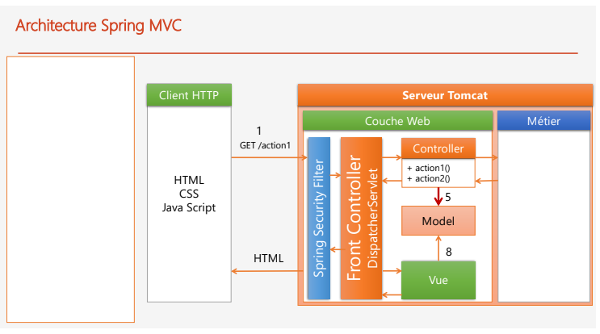

1-Ajouter les dependances Maven "Spring security"

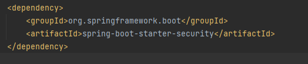

2-Ajout user1 ,user2 et admin dans "SecurityConfig" et le login form

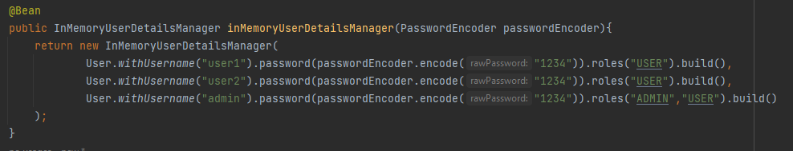

3-Ajouter passwordEncoder dans HospitalApplication

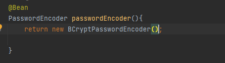

Declarer passwordEncoder dans SecurityConfig

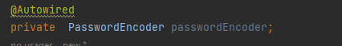

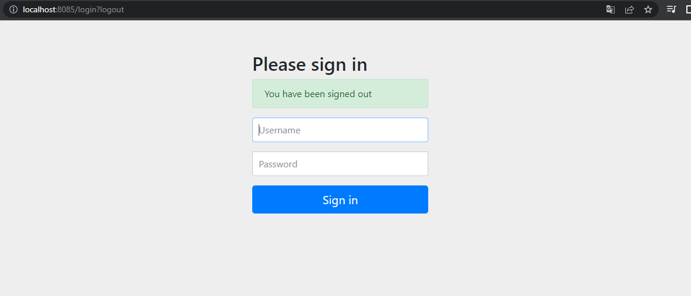

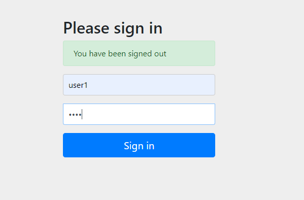

4-Afficher l'utilisateur Authentifier avec la dependance "tymeleaf extra spring security"

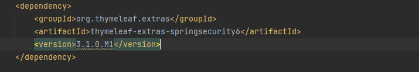

Pour afficher le nom d'utilisateur:

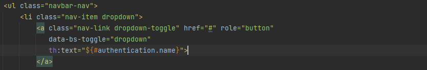

5-Logout:

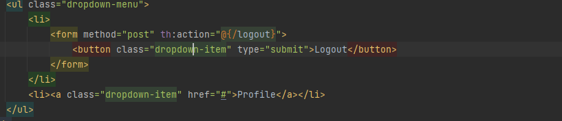

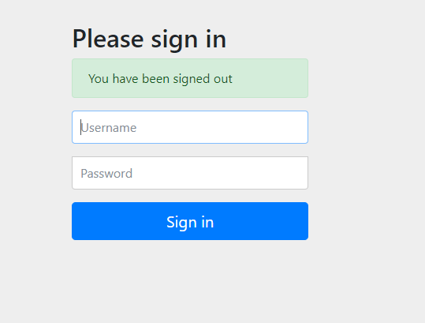

6-Gerer les autorisations:

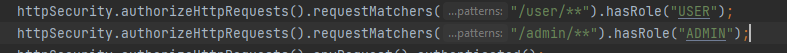

modifier les urls dans le controller 

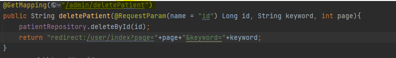

